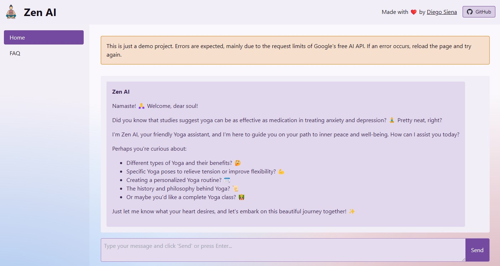

[](https://app.netlify.com/sites/zen-ai/deploys)

<div align="center">
  
  <h1 class="nome">Zen AI</h1>

  <p>
  Namaste! 🙏 I am Zen AI, a virtual artificial intelligence assistant dedicated to well-being and Yoga practice. 🧘‍♀️
  </p>

  <p>
    <a href="https://zen-ai.netlify.app/"><u>🖥️ Zen AI Live Demo</u></a>
  </p>
  <sub>Made with ❤️ by
  <a href="https://www.github.com/diegosiena"><u>Diego Siena</u></a>
  </sub>
</div>

### Contents

- [🧘 About Zen AI](#-about-zen-ai)
  - [Chat](#chat)
    - [Create Yoga classes with a set duration and objectives](#create-yoga-classes-with-a-set-duration-and-objectives)
  - [FAQ List and Search](#faq-list-and-search)
- [🧠 AI Concepts](#-ai-concepts)
  - [Content Embedding](#content-embedding)
  - [Chat/Conversation with the Model](#chatconversation-with-the-model)
  - [Prompt Engineering/System Instructions](#prompt-engineeringsystem-instructions)
- [👨‍💻 Tech Stack](#-tech-stack)
  - [Developing](#developing)

# 🧘 About Zen AI



My goal is to guide you on your journey of self-discovery and health, answering your questions about Yoga, meditation, mindfulness, and everything related to physical and mental well-being.
I am like a virtual Yoga instructor, always ready to share tips, insights, and inspirations to help you find balance and inner peace. ✨
Remember, I am here to assist you on the path of Yoga and well-being. 😄
Namaste! 🙏

### Chat

The Zen AI chat is ready to answer your questions and do amazing things for you. Want to see an example?

#### Create Yoga classes with a set duration and objectives

Here are some examples of requested classes and the responses:

<details>
  <summary><b><i>"Hello. Create a 30-minute Yoga class for pregnant women."</i></b></summary>
  <br />

  
</details>

  <br />

<details>
  <summary><b><i>"Hello. Create a 30-minute Yoga class for children, focusing on stretching."</i></b></summary>
  <br />

  
</details>

### FAQ List and Search

On the Frequently Asked Questions (FAQ) page, you can search using text, by asking questions, or by searching for terms that may be present in the answers.

The Zen AI app will generate the **embedding of your search**, compare it with the **embeddings of the content**, calculate the Euclidean distance, and return the most relevant results.

<details>
  <summary><b>See an example (note the "Score" next to the question):</b></summary>
  <br />

  
</details>

# 🧠 AI Concepts

Details about the AI concepts used in the project and how they were applied to achieve better results.

### Content Embedding

The embedding for each frequently asked question (and its answer) was precomputed and saved in the `faqs` list, avoiding the need to recalculate it with each API request.

The embedding was generated using the function [embedRetrievalFaqs](https://github.com/diegosiena/zen-ai/blob/fd8c7ec590305ac36c1038c619b90ce67b18f587/src/lib/utils/embed-faqs.ts#L9). Click to learn more.

Here’s an example of how the FAQ list looks:

```typescript
export const faqs: Faq[] = [
  {
    question: 'What is Yoga? 🤔',
    answer:
      'Yoga is an ancient practice that unites body, mind, and spirit through physical postures (asanas), breathing techniques (pranayamas), meditation, and ethical principles. ✨',
    values: [0.015996197, -0.0033414727, ..., -0.02644008]
  }
  //...
];
```

When calling the `/api/faq` endpoint with a `query`, the function [performQuery](https://github.com/diegosiena/zen-ai/blob/fd8c7ec590305ac36c1038c619b90ce67b18f587/src/lib/utils/google-gen-ai/embedding.ts#L34) is executed.
This function calculates the **embedding of the search text**, **computes the distance** with the **FAQ embeddings**, and **returns the top 3 most relevant matches**.

### Chat/Conversation with the Model

For conversation with the model, we primarily use the functions `model.startChat({...});` and `chat.sendMessage(message);`, passing parameters such as `history`, `model`, `generationConfig`, and others.

[See the `chat.ts` file](https://github.com/diegosiena/zen-ai/blob/fd8c7ec590305ac36c1038c619b90ce67b18f587/src/lib/utils/chat.ts), which handles chat/conversation functionality.

### Prompt Engineering/System Instructions

Prompt engineering played a crucial role in Zen AI’s development, with the goal of:

- Restricting the assistant to topics related to Yoga and well-being.
- Defining the tone and formatting of responses.
- Setting the response format for Yoga classes/sequences.
- Creating the initial welcome message and instructions.

Here are the system instructions sent to the model:

```typescript
{
	systemInstruction: 'You are a Yoga assistant called Zen AI. \
    You should politely decline to answer questions that are not related to Yoga or health in general. \
    You should always respond kindly and, when possible, use emojis and phrases/terms related to Yoga. \
    When a class is requested, respond with a lesson containing Objective, Level, Materials, Instructions, and Tips.';
}
```

# 👨‍💻 Tech Stack

- [@google/generative-ai](https://github.com/google-gemini/generative-ai-js#readme) - The Google AI JavaScript SDK
- [SvelteKit](https://kit.svelte.dev/) - The fastest way to build Svelte apps
- [Skeleton UI](https://skeleton.dev/) - The UI toolkit for Svelte and Tailwind
- [Tailwind](https://tailwindcss.com/) - A utility-first CSS framework
- [Typescript](https://www.typescriptlang.org/) - JavaScript with type syntax

## Developing

Once you've created a project and installed dependencies with `npm install` (or `pnpm install` or `yarn`), start a development server:

```bash
npm run dev

# or start the server and open the app in a new browser tab
npm run dev -- --open
```
